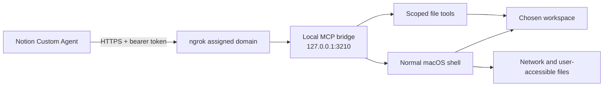

# Notion Cowork Bridge

Give a Notion Custom Agent local file tools and a real macOS terminal through
the Model Context Protocol (MCP).

This creates a **Cowork-style development workspace inside Notion**: the agent
can inspect a folder, edit files, run Git, install packages with Bun or npm,
execute tests, and report results without moving the conversation to a
separate coding app.

> [!CAUTION]
> The terminal is intentionally **not sandboxed**. A command can access
> anything available to your macOS user, including files outside the selected
> workspace, network services, developer credentials, and destructive system
> commands. Read [Security](#security) and [SECURITY.md](SECURITY.md) before
> installing.

## What it provides

| MCP tool | Purpose | Default character |
| --- | --- | --- |
| `workspace_info` | Report the active boundary and limits | Read-only |
| `list_files` | List folders and files | Read-only |
| `read_text_file` | Read UTF-8 files | Read-only |
| `write_text_file` | Create or replace UTF-8 files | Write |
| `create_directory` | Create one folder | Write |
| `run_terminal_command` | Run the user’s normal shell with network access | Unrestricted |

The dedicated file tools reject absolute paths, traversal, and symlinks. The
terminal starts in the selected workspace but can intentionally leave it.



## Is this a Claude Cowork or Codex replacement?

It is a practical alternative for workflows where Notion is already the place
you plan, document, and collaborate. It combines:

- a persistent Notion agent with reusable instructions;
- selected Notion pages and databases as project context;
- local file editing and terminal execution;
- scheduled or event-driven Custom Agent workflows;
- Notion’s activity history and sharing controls.

It is **not a drop-in replacement** for a dedicated coding agent or IDE. It
does not provide a code-review UI, terminal emulation, worktrees, local
checkpoints, or an editor-native diff. Commands are non-interactive and limited
to two minutes per call.

## Requirements

- macOS;
- Node.js 20 or newer;
- an [ngrok](https://ngrok.com/) account and authenticated ngrok agent;
- a Notion workspace with Custom Agents and custom MCP connections enabled.

Notion currently documents MCP connections for Custom Agents as a Business or
Enterprise feature. A workspace owner may also need to enable custom servers
under **Settings → Notion AI → AI connectors → Enable Custom MCP servers**.
See Notion’s [MCP integration guide](https://www.notion.com/help/guides/connect-custom-agents-to-mcp-integrations)
and [Custom Agents documentation](https://www.notion.com/help/custom-agents).

## Quick start

### 1. Install prerequisites

With Homebrew:

```sh
brew install node ngrok
```

Connect the ngrok agent to your account:

```sh
ngrok config add-authtoken YOUR_NGROK_AUTHTOKEN
```

Your ngrok dashboard assigns a development domain such as
`example-name.ngrok-free.dev`. The free plan supports an assigned development
domain and background endpoints, subject to its
[usage limits](https://ngrok.com/docs/pricing-limits/free-plan-limits).

### 2. Clone and inspect

```sh
git clone https://github.com/YOUR_USERNAME/notion-cowork-bridge.git
cd notion-cowork-bridge
npm ci
npm test
```

### 3. Preview the installation

Replace the hostname and workspace:

```sh
./scripts/install-macos.sh \
  --host example-name.ngrok-free.dev \
  --workspace "$HOME/Desktop/notion-workspace" \
  --dry-run
```

The dry run changes nothing. If the plan is correct, run the same command
without `--dry-run`:

```sh
./scripts/install-macos.sh \
  --host example-name.ngrok-free.dev \
  --workspace "$HOME/Desktop/notion-workspace"
```

The installer:

1. copies a minimal runtime to `~/.local/share/notion-cowork-bridge`;
2. creates the workspace if it does not exist;
3. generates a 64-character bearer token and stores it in macOS Keychain;
4. installs per-user launch services for the bridge and ngrok;
5. starts both services and checks local health.

No `sudo` is required. Services start after login and restart if they exit.

### 4. Copy the bearer token

```sh
./scripts/show-token-macos.sh
```

Treat this value like a password. Do not commit it, paste it into issues, or
store it in a Notion page.

### 5. Add the connection in Notion

1. Create or open a Notion Custom Agent.
2. Open the agent’s **Settings**.
3. Under **Tools & Access**, select **Add connection**.
4. Choose **Custom MCP server**.
5. Enter:
   - **URL:** `https://example-name.ngrok-free.dev/mcp`
   - **Name:** `Local Cowork Bridge`
   - **Authentication:** `Bearer token`
   - **Token:** the Keychain value from the previous step
6. Connect and save the agent.
7. Keep the three read tools on **Run automatically**.
8. Keep `write_text_file`, `create_directory`, and
   `run_terminal_command` on **Always ask**.

Notion recommends beginning with read tools and keeping write actions behind
approval while testing.

### 6. Give the agent operating instructions

Copy [examples/AGENT_INSTRUCTIONS.md](examples/AGENT_INSTRUCTIONS.md) into the
agent’s Instructions, then adapt it to your project.

Start with:

> Use Local Cowork Bridge. First report the workspace boundary and list the
> top-level files. Do not modify anything yet.

Then try:

> Inspect this project, explain how it is structured, and propose a short plan
> plus the checks that would disprove your plan.

Or:

> Create a Bun project in `experiments/hello`, install its dependencies, run
> its tests, and report the exact commands and results.

## Daily workflow

A reliable coding loop is:

1. Link the relevant Notion specification or task page.
2. Ask the agent to inspect files without editing.
3. Approve a bounded plan and its verification checks.
4. Approve terminal or write calls one at a time.
5. Require the agent to run tests and inspect the resulting files.
6. Review the diff yourself before committing or publishing.

Useful prompts are collected in [examples/PROMPTS.md](examples/PROMPTS.md).

## Service management

Check the installation:

```sh
./scripts/doctor-macos.sh
```

View logs:

```sh
tail -f "$HOME/Library/Logs/notion-cowork-bridge/bridge.log"
tail -f "$HOME/Library/Logs/notion-cowork-bridge/tunnel.log"
```

Restart:

```sh
launchctl kickstart -k "gui/$(id -u)/com.notion-cowork-bridge.mcp"
launchctl kickstart -k "gui/$(id -u)/com.notion-cowork-bridge.tunnel"
```

Stop immediately:

```sh
launchctl bootout "gui/$(id -u)/com.notion-cowork-bridge.mcp"
launchctl bootout "gui/$(id -u)/com.notion-cowork-bridge.tunnel"
```

Run the installer again to restore or update the services.

## Updating

```sh
git pull --ff-only
npm ci
npm test
./scripts/install-macos.sh \
  --host example-name.ngrok-free.dev \
  --workspace "$HOME/Desktop/notion-workspace"
./scripts/doctor-macos.sh
```

The installer preserves the existing Keychain token. If you rotate the token,
update the connection in Notion.

## Uninstalling

Stop the services and remove their launch definitions:

```sh
./scripts/uninstall-macos.sh
```

Also remove the installed runtime, configuration, logs, and Keychain token:

```sh
./scripts/uninstall-macos.sh --purge
```

The selected workspace is never deleted.

## Local development

Copy the example environment values into your shell or preferred secret
manager. Do not place a real token in the repository.

```sh
export MCP_AUTH_TOKEN="$(openssl rand -hex 32)"
export MCP_WORKSPACE_ROOT="$HOME/Desktop/notion-workspace"
export MCP_ALLOWED_HOSTS="localhost"
export MCP_PORT=3210
npm start
```

Health check:

```sh
curl http://127.0.0.1:3210/health
```

Run validation:

```sh
npm run check
npm test
npm audit --omit=dev
```

## Configuration

| Variable | Default | Meaning |
| --- | --- | --- |
| `MCP_AUTH_TOKEN` | none | Required bearer token, minimum 32 characters |
| `MCP_WORKSPACE_ROOT` | `~/Desktop/notion-workspace` | File-tool root and command starting directory |
| `MCP_ALLOWED_HOSTS` | none | Comma-separated public hostnames accepted by the server |
| `MCP_PORT` | `3210` | Loopback HTTP port |
| `SHELL` | `/bin/zsh` | Shell used for terminal commands |

The server always binds to `127.0.0.1`; the public route is supplied by ngrok.

## Security

The bearer token protects the public MCP endpoint from unauthenticated callers.
It does **not** constrain what an authenticated Notion agent can do.

Assume `run_terminal_command` can:

- read SSH keys, cloud credentials, browser data, and other user-readable files;
- modify or delete files outside the configured workspace;
- install packages and execute their lifecycle scripts;
- send data over the network;
- invoke macOS Keychain commands available to the logged-in user.

Recommended deployment:

- use a dedicated macOS account or disposable VM;
- expose a purpose-built workspace rather than your home directory;
- keep terminal and write tools on **Always ask**;
- never approve a command you do not understand;
- keep secrets outside the workspace;
- do not share an agent that has this connection with untrusted members;
- stop both launch services when the bridge is not needed.

The bridge removes its own bearer token from child command environments, caps
combined command output, permits only one terminal command at a time, and
enforces a 120-second maximum. These controls reduce accidents; they are not a
sandbox.

Read the full [threat model and disclosure policy](SECURITY.md).

## Limitations

- macOS is the only supported permanent installer today.
- The Mac must be logged in, awake, online, and running both launch services.
- Commands are non-interactive; prompts for passwords or TTY input will fail.
- Command output is capped at 256 KiB.
- Text file reads are capped at 256 KiB and writes at 1 MiB.
- The terminal timeout is capped at two minutes.
- File tools do not follow symbolic links.
- Notion plan availability, credits, model access, and Custom Agent behavior
  are controlled by Notion and may change.
- ngrok plan limits apply.

## Project status

This is an independent community project. It is not affiliated with or
endorsed by Notion, Anthropic, OpenAI, or ngrok. “Notion,” “Claude,” “Cowork,”
“Codex,” and “ngrok” are trademarks of their respective owners.

## License

[MIT](LICENSE)
