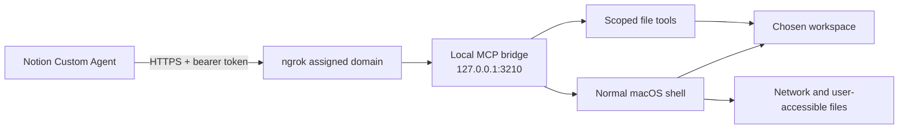

# Notion Cowork Bridge

Give a Notion Custom Agent real file tools and a real terminal, over the Model
Context Protocol. Runs on macOS, Linux, and Windows.

I kept hitting the same wall: the plan, the spec, and the task list all lived in
Notion, but the moment there was actual work to do I had to leave for a coding
app, do the work there, and then come back and write down what happened. This
bridge closes that loop. The agent reads a folder on my Mac, edits files, runs
Git, installs packages, runs the tests, and reports back — in the same thread
where the task was written.

> [!CAUTION]
> The terminal is **not sandboxed**, and that's deliberate. A command can reach
> anything your user account can reach: files outside the workspace, your
> network, your developer credentials, and destructive system commands. The
> threat that actually catches people is **prompt injection** — text in a page
> or a file steering the agent into running something you never asked for.
> Please read [Security](#security) and [SECURITY.md](SECURITY.md) before you
> install this.

## What you get

| MCP tool | What it does | Character |
| --- | --- | --- |
| `workspace_info` | Reports the active boundary and every enforced limit | Read-only |
| `list_files` | Lists folders and files | Read-only |
| `read_text_file` | Reads UTF-8 files, whole or by line range | Read-only |
| `write_text_file` | Creates or replaces a UTF-8 file | Write |
| `create_directory` | Creates one folder | Write |
| `run_terminal_command` | Runs your normal shell, with network access | Unrestricted |

The five file tools are strict: they reject absolute paths, reject `..`
traversal, and refuse to follow symlinks. The terminal starts inside the
workspace but is free to leave it — that's the whole point of it, and also the
reason the warning above is worded the way it is.



## Where this fits next to Claude Cowork or Codex

If Notion is already where you plan, write specs, and track work, this gets you
a surprising amount of the way there. You get a persistent agent with reusable
instructions, your Notion pages and databases as project context, real local
execution, scheduled and event-driven runs, and Notion's own activity history
and sharing controls around all of it.

It is not a drop-in replacement for a dedicated coding agent. There's no
code-review UI, no terminal emulation, no worktrees, no local checkpoints, and
no editor-native diff. Commands are non-interactive and capped at two minutes
each. I use it for the kind of work that's mostly reading, small edits, and
verification — not for a long refactor I'd want to watch closely.

## What you need

- macOS, Linux (systemd), or Windows 10/11
- Node.js 20 or newer
- an [ngrok](https://ngrok.com/) account with the agent authenticated
- a Notion workspace where Custom Agents and custom MCP connections are enabled

Each platform gets its own installer, service manager, and token store:

| | Installer | Runs under | Token stored in |
| --- | --- | --- | --- |
| macOS | `install-macos.sh` | launchd user agents | Keychain |
| Linux | `install-linux.sh` | systemd user units | file, mode `0600` |
| Windows | `install-windows.ps1` | Scheduled Tasks at logon | DPAPI-encrypted file |

Linux uses a `0600` file rather than a keyring because a desktop keyring is
normally locked when a user service starts at boot — a keyring-backed token
would fail to start about as often as it worked. [SECURITY.md](SECURITY.md)
explains the trade.

Notion currently documents MCP connections for Custom Agents as a Business or
Enterprise feature, and a workspace owner may additionally need to turn on
custom servers under **Settings → Notion AI → AI connectors → Enable Custom MCP
servers**. Notion's [MCP integration guide](https://www.notion.com/help/guides/connect-custom-agents-to-mcp-integrations)
and [Custom Agents docs](https://www.notion.com/help/custom-agents) are the
source of truth here, and both change fairly often.

## Setup

### 1. Install the prerequisites

macOS:

```sh
brew install node ngrok
```

Linux — install Node 20+ from your distribution or nodesource, then ngrok from
[their Linux instructions](https://ngrok.com/docs/getting-started/):

```sh
sudo snap install ngrok    # or the .deb / .rpm / tarball
```

Windows:

```powershell
winget install OpenJS.NodeJS.LTS
winget install ngrok.ngrok
```

Then, on every platform:

```sh
ngrok config add-authtoken YOUR_NGROK_AUTHTOKEN
```

Your ngrok dashboard assigns you a development domain that looks like
`example-name.ngrok-free.dev`. You need that exact hostname for the next steps.
The free plan gives you one assigned domain and background endpoints, within its
[usage limits](https://ngrok.com/docs/pricing-limits/free-plan-limits).

### 2. Clone it and look around

```sh
git clone https://github.com/sourabhmorankar/notion-cowork-bridge.git
cd notion-cowork-bridge
npm ci
npm test
```

You're about to expose a shell to a remote agent, so read
[src/server.js](src/server.js) before you go further. It's a single file, about
600 lines, and every limit in it is named in one place at the top.

### 3. Do a dry run first

Swap in your hostname and the folder you actually want to expose. macOS:

```sh
./scripts/install-macos.sh \
  --host example-name.ngrok-free.dev \
  --workspace "$HOME/Desktop/notion-workspace" \
  --dry-run
```

Linux:

```sh
./scripts/install-linux.sh \
  --host example-name.ngrok-free.dev \
  --workspace "$HOME/notion-workspace" \
  --dry-run
```

Windows, from PowerShell:

```powershell
.\scripts\install-windows.ps1 `
  -PublicHost example-name.ngrok-free.dev `
  -Workspace "$env:USERPROFILE\notion-workspace" `
  -DryRun
```

That validates your arguments and prints the plan without touching anything. If
the plan looks right, run it again without `--dry-run` / `-DryRun`.

The installer copies a minimal runtime outside the repository, creates the
workspace if it doesn't exist, generates a 64-character bearer token into the
platform's token store, registers two per-user services (the bridge and the
tunnel), starts them, and waits for the local health check to pass.

No `sudo` and no Administrator anywhere. The services come up at login and
restart themselves if they die.

On Linux the installer also runs `loginctl enable-linger`, without which your
user services stop the moment you log out. The parameter on Windows is
`-PublicHost`, not `-Host` — `$Host` is a reserved PowerShell variable.

### 4. Grab the token

```sh
./scripts/show-token-macos.sh      # macOS
./scripts/show-token-linux.sh      # Linux
```

```powershell
.\scripts\show-token-windows.ps1   # Windows
```

Treat it like a password. Don't commit it, don't paste it into an issue, and
don't park it in a Notion page — anyone with the token and the URL gets a shell
on your Mac.

### 5. Wire up the connection in Notion

1. Create or open a Notion Custom Agent.
2. Open the agent's **Settings**.
3. Under **Tools & Access**, choose **Add connection**.
4. Choose **Custom MCP server**.
5. Fill in:
   - **URL:** `https://example-name.ngrok-free.dev/mcp`
   - **Name:** `Local Cowork Bridge`
   - **Authentication:** `Bearer token`
   - **Token:** the value from step 4
6. Connect, then save the agent.
7. Leave the three read tools on **Run automatically**.
8. Leave `write_text_file`, `create_directory`, and `run_terminal_command` on
   **Always ask**. Notion recommends this too, and I'd keep it that way well
   past the point where you've stopped being nervous about it.

### 6. Give the agent its operating instructions

Copy [examples/AGENT_INSTRUCTIONS.md](examples/AGENT_INSTRUCTIONS.md) into the
agent's Instructions field and adapt it to your project. Then start small:

> Use Local Cowork Bridge. First report the workspace boundary and list the
> top-level files. Don't modify anything yet.

Once that works:

> Inspect this project, explain how it's structured, and propose a short plan
> plus the checks that would disprove your plan.

And when you trust it:

> Create a Bun project in `experiments/hello`, install its dependencies, run its
> tests, and report the exact commands and results.

## How I actually use it

The loop that works for me:

1. Link the Notion spec or task page so the agent has the requirement in front
   of it.
2. Ask it to inspect the code without editing anything.
3. Approve a bounded plan — and the check that would prove the plan wrong.
4. Approve terminal and write calls one at a time. Read them first.
5. Make it run the tests and then actually inspect the resulting files, not just
   the exit code.
6. Review the diff myself before anything gets committed.

More prompts I reuse are in [examples/PROMPTS.md](examples/PROMPTS.md).

## Keeping it running

Check the whole installation at once — `doctor-macos.sh`, `doctor-linux.sh`, or
`doctor-windows.ps1`. Each prints a PASS/FAIL line per check and exits non-zero
if anything is wrong.

**macOS**

```sh
tail -f "$HOME/Library/Logs/notion-cowork-bridge/bridge.log"
launchctl kickstart -k "gui/$(id -u)/com.notion-cowork-bridge.mcp"
launchctl bootout "gui/$(id -u)/com.notion-cowork-bridge.mcp"      # stop now
launchctl bootout "gui/$(id -u)/com.notion-cowork-bridge.tunnel"
```

**Linux**

```sh
journalctl --user -u notion-cowork-bridge -f
systemctl --user restart notion-cowork-bridge.service
systemctl --user stop notion-cowork-bridge.service \
  notion-cowork-bridge-tunnel.service                              # stop now
```

**Windows**

```powershell
Get-ScheduledTask -TaskName NotionCoworkBridge | Get-ScheduledTaskInfo
Stop-ScheduledTask -TaskName NotionCoworkBridge
Start-ScheduledTask -TaskName NotionCoworkBridge
Stop-ScheduledTask -TaskName NotionCoworkBridgeTunnel               # stop now
```

Re-running the installer restores or updates both services.

## The audit log

Every terminal command, file write, and folder creation is appended as one JSON
line. The start of a command is recorded *before* it runs, so even a command
that hangs and gets killed leaves a trace.

| Platform | Location |
| --- | --- |
| macOS | `~/Library/Logs/notion-cowork-bridge/audit.jsonl` |
| Linux | `~/.local/state/notion-cowork-bridge/audit.jsonl` |
| Windows | `%LOCALAPPDATA%\notion-cowork-bridge\audit.jsonl` |

```sh
# What has the agent actually run?
grep '"run_terminal_command.start"' audit.jsonl | jq -r '.time + "  " + .command'

# Anything that failed or was killed?
jq -c 'select(.event == "run_terminal_command.finish" and (.exitCode != 0 or .timedOut))' audit.jsonl
```

Read it after any session where the agent touched content you didn't write
yourself. The bearer token is never written to it.

It is a flight recorder, not a lock: the same process that runs the commands
writes the log, and anything running as your user can edit it.

## Troubleshooting

**Notion says it can't connect.** Check the public endpoint yourself first:

```sh
curl -i https://example-name.ngrok-free.dev/health
```

A `200` with `{"status":"ok"}` means the tunnel and bridge are both fine and the
problem is on the Notion side — usually the URL is missing the `/mcp` suffix.

**Everything returns 401.** The token in Notion doesn't match the one in the
Keychain. Re-copy it with `./scripts/show-token-macos.sh` and paste it into the
connection again. Watch for a trailing space; that bites more often than you'd
expect.

**The public health check fails but the local one passes.** The tunnel is down.
Look at `tunnel.log` — the usual causes are an expired ngrok authtoken, a
different domain than the one you installed with, or another `ngrok` process
already holding the domain. `pkill ngrok` and then kickstart the tunnel service.

**`doctor-macos.sh` reports a missing Keychain token.** macOS prompts before
letting a script read the Keychain, and a denied prompt looks identical to a
missing entry. Run `./scripts/show-token-macos.sh` in Terminal and choose
**Always Allow**.

**The bridge won't start and `bridge.log` mentions `MCP_AUTH_TOKEN`.** The
launch service couldn't read the Keychain, so the server refused to boot with a
short or empty token. Same fix as above.

**A command times out at exactly two minutes.** That's the hard cap, and it's
not configurable from Notion. Split the work, or run the long part yourself.

**A command hangs and then fails with no useful output.** It was waiting for
input. Nothing here has a TTY, so anything that prompts — `sudo`, an SSH
passphrase, an interactive `git rebase` — will just sit there until the timeout.

**`list_files` says symbolic links are not allowed.** That's working as
intended: the file tools never follow a link, because a link is the easiest way
out of the workspace. Use `run_terminal_command` if you genuinely need the
target.

**The Mac went to sleep.** Both services stop answering. The Mac has to be
logged in, awake, and online for any of this to work.

## Rotating the token

Rotate whenever the token might have leaked, when someone leaves the agent's
share list, or just periodically:

```sh
./scripts/rotate-token-macos.sh       # macOS
./scripts/rotate-token-linux.sh       # Linux
```

```powershell
.\scripts\rotate-token-windows.ps1    # Windows
```

It generates a fresh 64-character token, replaces the stored one, and restarts
the bridge. The old token stops working immediately, so update the
connection in Notion right after — `./scripts/show-token-macos.sh` prints the
new value.

## Updating

```sh
git pull --ff-only
npm ci
npm test
./scripts/install-macos.sh \
  --host example-name.ngrok-free.dev \
  --workspace "$HOME/Desktop/notion-workspace"
./scripts/doctor-macos.sh
```

The installer keeps your existing Keychain token, so the Notion connection
survives an update untouched.

## Uninstalling

Stop the services and remove their definitions:

```sh
./scripts/uninstall-macos.sh          # macOS
./scripts/uninstall-linux.sh          # Linux
```

```powershell
.\scripts\uninstall-windows.ps1       # Windows
```

Add `--purge` (or `-Purge` on Windows) to also delete the installed runtime,
config, logs, audit log, and the stored token.

Your workspace is never deleted, purge or not.

## Running it from source

Handy while you're changing the server. [.env.example](.env.example) lists the
same variables; keep the real token in your shell or a secret manager rather
than in a file in the repo.

```sh
export MCP_AUTH_TOKEN="$(openssl rand -hex 32)"
export MCP_WORKSPACE_ROOT="$HOME/Desktop/notion-workspace"
export MCP_ALLOWED_HOSTS="localhost"
export MCP_PORT=3210
npm start
```

```sh
curl http://127.0.0.1:3210/health
```

Before you open a pull request:

```sh
npm run check
npm test
npm audit --omit=dev
```

The test suite needs a workspace outside the repo, since it verifies that the
bridge refuses to modify its own files. By default it uses two directories above
the repo; set `TEST_WORKSPACE_ROOT` to point it somewhere else. The Bun test
skips itself if Bun isn't installed.

## Configuration

| Variable | Default | What it does |
| --- | --- | --- |
| `MCP_AUTH_TOKEN` | none | Required bearer token, minimum 32 characters |
| `MCP_WORKSPACE_ROOT` | `~/Desktop/notion-workspace` | File-tool root, and where commands start |
| `MCP_ALLOWED_HOSTS` | none | Comma-separated public hostnames the server will answer for |
| `MCP_PORT` | `3210` | Loopback HTTP port |
| `MCP_AUDIT_LOG` | per-platform (above) | Where the JSON-lines audit log is written |
| `MCP_SHELL` | see below | Shell used for terminal commands |
| `SHELL` | — | Used as the shell on macOS and Linux when `MCP_SHELL` is unset |

The shell defaults to `$SHELL` if it's an absolute path, then `/bin/zsh` on
macOS, `/bin/bash` on Linux, and `powershell.exe` on Windows. Commands are
handed over as `-lc` for POSIX shells, `-NoProfile -NonInteractive -Command`
for PowerShell, and `/d /s /c` for `cmd.exe`.

The server always binds to `127.0.0.1`. The only public route is the one ngrok
gives you.

## Security

The bearer token answers exactly one question: may this caller talk to the MCP
server? It does nothing to constrain what an authenticated agent then does.

The threat most people underrate is **prompt injection**. Your agent reads
Notion pages, comments, repository files and command output — any of which
someone else may have written. Text in those places can steer the agent into
running something you never asked for, and the approval prompt is your only
defence. It wears out: after forty approved `git status` calls you will approve
the forty-first without reading it. [SECURITY.md](SECURITY.md) goes into detail.

Assume `run_terminal_command` can:

- read your SSH keys, cloud credentials, browser data, and anything else your
  user can read
- modify or delete files anywhere outside the workspace
- install packages and run their lifecycle scripts
- send data over the network
- call the macOS Keychain tools available to your login

How I'd deploy it:

- use a dedicated macOS account or a disposable VM
- expose a purpose-built workspace, never your home directory
- keep the terminal and write tools on **Always ask**
- never approve a command you don't understand
- keep secrets out of the workspace
- don't share an agent that has this connection with people you wouldn't hand a
  terminal to
- stop both launch services when you're not using the bridge

The bridge does strip its own bearer token from child command environments, cap
combined command output, allow only one terminal command at a time, enforce a
120-second ceiling, and write every consequential action to an
[audit log](#the-audit-log). Those controls prevent accidents and let you
reconstruct what happened. They are not a sandbox and won't stop a determined
command.

The full threat model and the disclosure process are in [SECURITY.md](SECURITY.md).

## Known limits

- The machine has to be logged in, awake, online, and running both services.
- Linux needs systemd; there's no SysV or OpenRC installer.
- On Windows the scripts are PowerShell 5.1+ and register Scheduled Tasks, so
  they need a real user session at logon.
- Commands are non-interactive. Anything that prompts for input will fail.
- Command output is capped at 256 KiB.
- Text reads are capped at 256 KiB; writes at 1 MiB.
- The terminal timeout tops out at two minutes.
- File tools never follow symlinks.
- Notion controls plan availability, credits, model access, and Custom Agent
  behavior, and any of it can change without notice.
- ngrok's plan limits apply on top of everything else.

## Contributing

Bug reports and pull requests are welcome — see
[CONTRIBUTING.md](CONTRIBUTING.md) for what I look for. If you've found a
security issue, please use GitHub's private vulnerability reporting instead of
an issue.

## Project status

This is an independent side project of mine. It isn't affiliated with or
endorsed by Notion, Anthropic, OpenAI, or ngrok. "Notion," "Claude," "Cowork,"
"Codex," and "ngrok" belong to their respective owners.

## License

[MIT](LICENSE) — Sourabh Morankar
