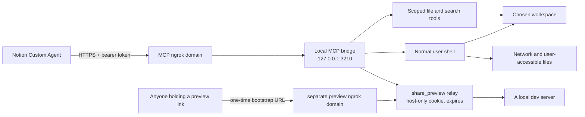

# Notion Cowork Bridge

Give a Notion Custom Agent real file tools and a real terminal, over the Model
Context Protocol. Runs on macOS, Linux, and Windows.

**Before you spend ten minutes on this, check you can actually use it:**

- **Notion Business or Enterprise**, with Custom Agents and custom MCP
  connections enabled — a workspace owner may have to turn that on for you
- **Node 20 or newer**, and an **ngrok account** (the free tier is enough)
- **A machine you are willing to give a remote agent a shell on.** Read the
  warning below before you decide that.

I kept hitting the same wall: the plan, the spec, and the task list all lived in
Notion, but the moment there was actual work to do I had to leave for a coding
app, do the work there, and then come back and write down what happened. This
bridge closes that loop. The agent reads a folder on my machine, edits files,
runs Git, installs packages, runs the tests, and reports back — in the same
thread where the task was written.

> [!CAUTION]
> The terminal is **not sandboxed**, and that's deliberate. A command can reach
> anything your user account can reach: files outside the workspace, your
> network, your developer credentials, and destructive system commands. The
> threat that actually catches people is **prompt injection** — text in a page
> or a file steering the agent into running something you never asked for.
> If you configure a distinct preview endpoint, `share_preview` can put a
> locally running app behind a public URL that anyone holding the link can open,
> with no login. It never reuses the MCP endpoint for this. Please read
> [Security](#security) and [SECURITY.md](SECURITY.md) before you install this.

## What you get

Thirty-two tools. The character column comes from each tool's own MCP
annotations, which is what Notion looks at when it decides whether to ask you
first: "read-only" means `readOnlyHint: true` and "destructive" means
`destructiveHint: true`. Where a tool needs more than an annotation to describe
it — the terminal, the preview — I've said so instead.

**Files** — everything below is confined to the workspace.

| MCP tool | What it does | Character |
| --- | --- | --- |
| `list_files` | Lists folders and files, skipping `node_modules` and friends | Read-only |
| `read_text_file` | Reads UTF-8 files, whole or by line range | Read-only |
| `read_bytes` | Reads a byte range from any file, base64-encoded | Read-only |
| `write_text_file` | Creates or replaces a UTF-8 file | Destructive |
| `edit_text_file` | Replaces exact strings and returns a diff | Destructive |
| `create_directory` | Creates one folder | Write |
| `delete_path` | Deletes, into `.bridge-trash` unless you ask for permanent | Destructive |
| `move_path` | Moves or renames, never over an existing destination | Destructive |

**Search** — same boundary, same ignore list.

| MCP tool | What it does | Character |
| --- | --- | --- |
| `search_text` | Regex search through workspace text files | Read-only |
| `glob_files` | Finds files by name pattern | Read-only |

**Terminal and background processes** — not confined to anything.

| MCP tool | What it does | Character |
| --- | --- | --- |
| `run_terminal_command` | Runs your normal shell, with network access | Unrestricted |
| `start_background_process` | Spawns something meant to keep running and returns straight away | Unrestricted |
| `list_background_processes` | Shows what it started and whether it's still alive | Read-only |
| `read_process_output` | Reads a background process's log | Read-only |
| `stop_background_process` | Kills a background process and its whole group | Destructive |

**Preview and media**

| MCP tool | What it does | Character |
| --- | --- | --- |
| `http_probe` | Sends one HTTP request to a loopback port and reads the answer | Loopback only |
| `http_request` | Sends a consequential POST/PUT/PATCH/DELETE request to loopback | Consequential |
| `share_preview` | Creates a temporary authenticated public endpoint for a local port | Public exposure |
| `stop_preview` | Revokes one preview link, or all of them | Destructive |
| `read_media_file` | Reads an image out of the workspace as an image | Read-only |
| `capture_screenshot` | Renders a loopback page to a PNG in the workspace | Write |

**Isolated browser** — an ephemeral Chrome, Chromium, or Edge profile for checking a local app without exposing personal browser state.

| MCP tool | What it does | Character |
| --- | --- | --- |
| `browser_status` | Reports browser availability and sessions | Read-only |
| `browser_open` | Opens an allowed loopback app | Consequential |
| `browser_snapshot` | Lists page controls with opaque references | Read-only |
| `browser_console` / `browser_network` | Reads bounded diagnostics | Read-only |
| `browser_screenshot` | Returns a page PNG directly | Read-only |
| `browser_interact` | Clicks, types, selects, scrolls, or waits | Consequential |
| `browser_eval` | Runs bounded page-only JavaScript | Consequential |
| `browser_upload` | Uploads a workspace file through a file input | Consequential |
| `browser_close` | Closes the ephemeral session | Destructive |

**Policy**

| MCP tool | What it does | Character |
| --- | --- | --- |
| `workspace_info` | Reports the active boundary, every enforced limit, live previews and background processes | Read-only |

Twelve of those tools — the eight file tools, both search tools, and both media
tools — are strict about where they can point: they reject absolute paths,
reject `..` traversal, and refuse to follow symlinks at any segment of the
path. The terminal starts inside the workspace but is free to leave it, and
`share_preview` deliberately hands a URL to the internet. That's the whole
point of both of them, and also the reason the warning above is worded the way
it is.



## Where this fits next to Claude Cowork or Codex

If Notion is already where you plan, write specs, and track work, this gets you
a surprising amount of the way there. You get a persistent agent with reusable
instructions, your Notion pages and databases as project context, real local
execution, scheduled and event-driven runs, and Notion's own activity history
and sharing controls around all of it.

It is not a drop-in replacement for a dedicated coding agent. There's no
code-review UI, no terminal emulation, no worktrees, no local checkpoints, and
no editor-native diff. Commands are non-interactive, and a foreground command
is capped at two minutes — anything meant to run longer has to go through the
background-process tools. I use it for the kind of work that's mostly reading,
small edits, and verification — not for a long refactor I'd want to watch
closely.

## What you need

- macOS, Linux (systemd), or Windows 10/11
- Node.js 20 or newer
- an [ngrok](https://ngrok.com/) account with the agent authenticated
- a Notion workspace where Custom Agents and custom MCP connections are enabled
- optionally, Chrome, Chromium or Edge, if you want `capture_screenshot` to
  work. Nothing here bundles a browser or installs one, and every other tool
  works without it.

`./scripts/bridge` (or `.\scripts\bridge.ps1` on Windows) is the one command to
remember; it picks the right script for whatever you're on. Underneath, each
platform still gets its own installer, service manager, and token store:

| | Installer | Runs under | Token stored in |
| --- | --- | --- | --- |
| macOS | `install-macos.sh` | launchd user agents | Keychain |
| Linux | `install-linux.sh` | systemd user units | file, mode `0600` |
| Windows | `install-windows.ps1` | Scheduled Tasks at logon | DPAPI-encrypted file |

Linux uses a `0600` file rather than a keyring because a desktop keyring is
normally locked when a user service starts at boot — a keyring-backed token
would fail to start about as often as it worked. [SECURITY.md](SECURITY.md)
explains the trade.

Notion currently documents MCP connections for Custom Agents as a Business or
Enterprise feature, and a workspace owner may additionally need to turn on
custom servers under **Settings → Notion AI → AI connectors → Enable Custom MCP
servers**. Notion's [MCP integration guide](https://www.notion.com/help/guides/connect-custom-agents-to-mcp-integrations)
and [Custom Agents docs](https://www.notion.com/help/custom-agents) are the
source of truth here, and both change fairly often.

## Setup

### 1. Install the prerequisites

macOS:

```sh
brew install node ngrok
```

Linux — install Node 20+ from your distribution or nodesource, then ngrok from
[their Linux instructions](https://ngrok.com/docs/getting-started/):

```sh
sudo snap install ngrok    # or the .deb / .rpm / tarball
```

Windows:

```powershell
winget install OpenJS.NodeJS.LTS
winget install ngrok.ngrok
```

Then, on every platform:

```sh
ngrok config add-authtoken YOUR_NGROK_AUTHTOKEN
```

Your ngrok dashboard assigns you a development domain that looks like
`example-name.ngrok-free.dev`. You need that exact hostname for the next steps.
The free plan gives you one assigned domain and background endpoints, within its
[usage limits](https://ngrok.com/docs/pricing-limits/free-plan-limits).

### 2. Clone it and look around

```sh
git clone https://github.com/soumosa/notion-cowork-bridge.git
cd notion-cowork-bridge
npm ci
npm test
```

You can try the whole thing here, before any of the installer steps below,
without registering a service or opening a tunnel:

```sh
npm run dev
```

That generates a throwaway token for this run only, starts the bridge on
`127.0.0.1`, and prints a ready-to-paste `curl`. Nothing is written outside the
checkout, nothing survives Ctrl+C, and no ngrok is involved. If you just want to
see what the thing is before deciding, start there.

### 3. Read the code

You're about to expose a shell to a remote agent, so read it before you go
further. Up to 1.1.0 I could tell you to read one file, about 760 lines. That
stopped being honest at twenty-one tools: a 2,500-line `server.js` is a file
people say they've read. So it's now a server, a small library of primitives,
and one file per group of tools.

| File | Lines | What's in it |
| --- | --- | --- |
| `src/server.js` | 427 | boot, express, auth, transport, shutdown, `workspace_info` |
| `src/lib/config.js` | 144 | every environment variable and every limit, in one place |
| `src/lib/paths.js` | 169 | the workspace boundary and the per-segment symlink guards |
| `src/lib/audit.js` | 180 | the audit log, its hash chain, and the OS-log mirror |
| `src/lib/textfile.js` | 318 | line scanning, atomic writes, the edit and diff engine |
| `src/lib/errors.js` | 84 | the stable error codes |
| `src/lib/globs.js` | 79 | the ignore list the three read tools share |
| `src/tools/files.js` | 563 | the eight file tools |
| `src/tools/process.js` | 685 | the terminal and the background processes |
| `src/tools/preview.js` | 507 | `http_probe`, `share_preview`, `stop_preview` |
| `src/tools/media.js` | 270 | images and screenshots |
| `src/tools/search.js` | 195 | `search_text` and `glob_files` |
| `src/tools/index.js` | 48 | the list of tool modules, and nothing else |

3,669 lines across thirteen files, against 764 in one. That is a weaker claim
than the one it replaces and I'm not going to dress it up as an upgrade. "Read
this one file" is a promise a stranger can actually keep; "read these thirteen"
is a promise most people will keep halfway.

What I can offer instead: no framework, no plugin system, no dependency
injection, three runtime dependencies, and [src/lib/README.md](src/lib/README.md)
stating the contract a tool module signs — so reading one tool file tells you
what that tool can reach without reading the rest. If you read only two, read
`src/lib/paths.js`, which is the boundary, and `src/tools/process.js`, which is
the thing that has no boundary.

### 4. Do a dry run first

There is one entry point for all of this. `./scripts/bridge` works out which
platform you're on and calls the right script underneath; on Windows it's
`.\scripts\bridge.ps1`. The verbs are `install`, `doctor`, `token`, `rotate`,
`uninstall`, `logs`, `audit`, and `set-workspace`. The per-platform scripts are
all still there and still work if you'd rather call them directly.

Swap in your hostname and the folder you actually want to expose. macOS and
Linux:

```sh
./scripts/bridge install \
  --host example-name.ngrok-free.dev \
  --workspace "$HOME/Desktop/notion-workspace" \
  --dry-run
```

Windows, from PowerShell:

```powershell
.\scripts\bridge.ps1 install `
  -PublicHost example-name.ngrok-free.dev `
  -Workspace "$env:USERPROFILE\notion-workspace" `
  -DryRun
```

That validates your arguments and prints the plan without touching anything. If
the plan looks right, run it again without `--dry-run` / `-DryRun`.

The installer copies a minimal runtime outside the repository, creates the
workspace if it doesn't exist, generates a 64-character bearer token into the
platform's token store, registers two per-user services (the bridge and the
tunnel), starts them, and waits for the local health check to pass.

No `sudo` and no Administrator anywhere. The services come up at login and
restart themselves if they die.

On Linux the installer also runs `loginctl enable-linger`, without which your
user services stop the moment you log out. The parameter on Windows is
`-PublicHost`, not `-Host` — `$Host` is a reserved PowerShell variable.

If you want a second, independent check in front of the bearer token, pass
`--traffic-policy-file` and point it at a copy of
[examples/ngrok-traffic-policy.yml](examples/ngrok-traffic-policy.yml). It makes
ngrok answer 404 to anything that doesn't carry a header value you chose, so a
scanner that finds your domain never learns there's an MCP server behind it.
Optional, and [SECURITY.md](SECURITY.md) is honest about what it is and isn't.

### 5. Grab the token

```sh
./scripts/bridge token       # macOS and Linux
```

```powershell
.\scripts\bridge.ps1 token   # Windows
```

Treat it like a password. Don't commit it, don't paste it into an issue, and
don't park it in a Notion page — anyone with the token and the URL gets a shell
on the machine you installed this on.

### 6. Wire up the connection in Notion

1. Create or open a Notion Custom Agent.
2. Open the agent's **Settings**.
3. Under **Tools & Access**, choose **Add connection**.
4. Choose **Custom MCP server**.
5. Fill in:
   - **URL:** `https://example-name.ngrok-free.dev/mcp`
   - **Name:** `Local Cowork Bridge`
   - **Authentication:** `Bearer token`
   - **Token:** the value from step 5
6. Connect, then save the agent.
7. Leave the read-only tools on **Run automatically** — `workspace_info`,
   `list_files`, `read_text_file`, `read_bytes`, `search_text`, `glob_files`,
   `read_media_file`, `list_background_processes`, and `read_process_output`.
   None of them change anything.
8. Leave everything else on **Always ask**: the writes, the deletes,
   `run_terminal_command`, `start_background_process`, `capture_screenshot`,
   and — most of all — `share_preview`, which is the one that hands a URL to
   the internet. Notion recommends this too, and I'd keep it that way well
   past the point where you've stopped being nervous about it.

### 7. Give the agent its operating instructions

Copy [examples/AGENT_INSTRUCTIONS.md](examples/AGENT_INSTRUCTIONS.md) into the
agent's Instructions field and adapt it to your project. Then start small:

> Use Local Cowork Bridge. First report the workspace boundary and list the
> top-level files. Don't modify anything yet.

Once that works:

> Inspect this project, explain how it's structured, and propose a short plan
> plus the checks that would disprove your plan.

And when you trust it:

> Create a Bun project in `experiments/hello`, install its dependencies, run its
> tests, and report the exact commands and results.

## How I actually use it

The loop that works for me:

1. Link the Notion spec or task page so the agent has the requirement in front
   of it.
2. Ask it to inspect the code without editing anything.
3. Approve a bounded plan — and the check that would prove the plan wrong.
4. Approve terminal and write calls one at a time. Read them first.
5. Make it run the tests and then actually inspect the resulting files, not just
   the exit code.
6. Review the diff myself before anything gets committed.

More prompts I reuse are in [examples/PROMPTS.md](examples/PROMPTS.md).

## Things worth knowing about the newer tools

**Edits are edits now, not rewrites.** `edit_text_file` takes a list of exact
old string / new string pairs, requires each one to match exactly once unless
you say otherwise, and returns a unified diff of what it changed instead of the
whole file. If any edit in the list is missing or ambiguous, the entire call
fails and nothing is written. `dry_run: true` shows you the diff without
touching the file.

Both `edit_text_file` and `write_text_file` take an optional `if_sha256`. Pass
the `sha256` a previous write or edit returned, and the call is rejected with
`E_PRECONDITION_FAILED` if the file has changed since. This is the thing that
stops an agent from silently clobbering an edit you made in your editor while it
was thinking. It hashes the file's exact bytes, so carry forward the `sha256`
from a prior write rather than hashing the text you read.

**Searching no longer needs the shell.** `search_text` runs a regex over
workspace text files and `glob_files` matches names, both skipping `.git`,
`node_modules`, `dist`, `build`, `target`, `.venv`, `__pycache__`,
`.bridge-trash` and whatever the workspace's `.gitignore` excludes. That matters
for more than convenience: every search the agent does this way is one fewer
`grep` through `run_terminal_command`, which is one fewer approval prompt you
have to read carefully.

**Deleting has an undo.** `delete_path` moves things into `.bridge-trash/`
rather than unlinking them, unless you pass `permanent: true`. Empty it
yourself; nothing empties it for you.

**Background processes.** `start_background_process` spawns detached, redirects
stdout and stderr to a log file, and returns immediately with an id. Use it for
dev servers, watchers, anything that doesn't exit on its own.
`read_process_output` tails the log, `list_background_processes` says what's
alive, and `stop_background_process` kills the whole process group. Everything
tracked is killed when the bridge shuts down.

**`http_probe`** sends one HTTP request to a port on `127.0.0.1` and gives back
the status, timing, headers and body — with a `text` mode that strips scripts,
styles and tags so an SSR page comes back readable. It takes a port number, not
a URL, and it will not talk to anything off the loopback interface. That's
deliberate: a hostname argument is something a poisoned README could point at
your router.

**`share_preview`** puts a locally running app behind a separate reserved
ngrok HTTPS endpoint, with a one-time bootstrap URL and a TTL, so you can
actually open the thing the agent just built. It requires `confirm_public: true`,
because it is a real exposure and I want you to have typed that. It fails safely
unless `MCP_NGROK_PREVIEW_URL` is configured to a distinct endpoint. Read the section in
[SECURITY.md](SECURITY.md) before you use it — a dev server behind a public URL
gives away more than you think.

**Screenshots.** `capture_screenshot` renders a loopback page to a PNG in the
workspace using the same isolated browser manager as the interactive browser
tools, and `read_media_file` reads any image back as an image. No browser is
bundled or installed. `http_probe` is cheaper and tells the agent more, so
reach for the screenshot when the question is genuinely about how something
looks.

## Keeping it running

Check the whole installation at once with `./scripts/bridge doctor`
(`.\scripts\bridge.ps1 doctor` on Windows). It prints a PASS/FAIL line per check
and exits non-zero if anything is wrong, and warns when the token is more than
90 days old. `bridge logs` follows the bridge's own process log; `bridge audit`
follows the structured one.

The service commands underneath, if you want them directly:

**macOS**

```sh
tail -f "$HOME/Library/Logs/notion-cowork-bridge/bridge.log"
launchctl kickstart -k "gui/$(id -u)/com.notion-cowork-bridge.mcp"
launchctl bootout "gui/$(id -u)/com.notion-cowork-bridge.mcp"      # stop now
launchctl bootout "gui/$(id -u)/com.notion-cowork-bridge.tunnel"
```

**Linux**

```sh
journalctl --user -u notion-cowork-bridge -f
systemctl --user restart notion-cowork-bridge.service
systemctl --user stop notion-cowork-bridge.service \
  notion-cowork-bridge-tunnel.service                              # stop now
```

**Windows**

```powershell
Get-ScheduledTask -TaskName NotionCoworkBridge | Get-ScheduledTaskInfo
Stop-ScheduledTask -TaskName NotionCoworkBridge
Start-ScheduledTask -TaskName NotionCoworkBridge
Stop-ScheduledTask -TaskName NotionCoworkBridgeTunnel               # stop now
```

Re-running the installer restores or updates both services.

## The audit log

Every consequential action — terminal commands, background processes, writes,
edits, deletes, moves, folder creation, previews shared, and failed
authentication attempts — is appended as one JSON line. Each one is recorded
*before* it happens and again after, so even a command that hangs and gets
killed leaves a trace.

| Platform | Location |
| --- | --- |
| macOS | `~/Library/Logs/notion-cowork-bridge/audit.jsonl` |
| Linux | `~/.local/state/notion-cowork-bridge/audit.jsonl` |
| Windows | `%LOCALAPPDATA%\notion-cowork-bridge\audit.jsonl` |

It rotates at 10 MB and keeps five files. Every record also carries `prevHash`,
the SHA-256 of the previous line, and is mirrored to the operating system's own
log. What that buys is explained in [SECURITY.md](SECURITY.md), including what
it doesn't.

```sh
# What has the agent actually run?
grep '"run_terminal_command.start"' audit.jsonl | jq -r '.time + "  " + .command'

# Anything that failed or was killed?
jq -c 'select(.event == "run_terminal_command.finish" and (.exitCode != 0 or .timedOut))' audit.jsonl

# Anything that went near credentials, a keychain, or a pipe into a shell?
jq -c 'select(.flagged)' audit.jsonl

# Is somebody knocking who shouldn't be?
jq -c 'select(.event == "auth.failure")' audit.jsonl
```

Read it after any session where the agent touched content you didn't write
yourself. The bearer token is never written to it.

It is a flight recorder, not a lock: the same process that runs the commands
writes the log, and anything running as your user can edit it. The hash chain
means you can tell afterwards that it happened.

## Troubleshooting

**Notion says it can't connect.** Check the public endpoint yourself first:

```sh
curl -i https://example-name.ngrok-free.dev/health
```

A `200` with `{"status":"ok"}` means the tunnel and bridge are both fine and the
problem is on the Notion side — usually the URL is missing the `/mcp` suffix.

**Everything returns 401.** The token in Notion doesn't match the stored one.
Re-copy it with `./scripts/bridge token` and paste it into the connection again.
Watch for a trailing space; that bites more often than you'd expect. Repeated
401s from the same source get an escalating delay, up to five seconds, and each
one is written to the audit log — so if `jq 'select(.event == "auth.failure")'`
shows attempts you can't account for, that's somebody else.

**The public health check fails but the local one passes.** The tunnel is down.
Look at `tunnel.log` — the usual causes are an expired ngrok authtoken, a
different domain than the one you installed with, or another `ngrok` process
already holding the domain. `pkill ngrok` and then kickstart the tunnel service.

**`bridge doctor` reports a missing Keychain token on macOS.** macOS prompts
before letting a script read the Keychain, and a denied prompt looks identical
to a missing entry. Run `./scripts/bridge token` in Terminal and choose
**Always Allow**.

**The bridge won't start and `bridge.log` mentions `MCP_AUTH_TOKEN`.** The
launch service couldn't read the Keychain, so the server refused to boot with a
short or empty token. Same fix as above.

**A command times out at exactly two minutes.** That's the hard cap on a
foreground command and it isn't configurable from Notion. Split the work, run
the long part yourself, or start it with `start_background_process` and poll
`read_process_output`.

**A second command fails saying one is already running.** Only one foreground
command runs at a time. The tool now waits up to ten seconds for the slot before
giving up, so this only shows up when something genuinely long is in flight.

**A command hangs and then fails with no useful output.** Almost always it
started something that outlived it. The tool waits for the child's output
pipes to close, not just for the shell to exit, so `npm run dev &` holds the
call open for the full timeout and then the whole process group is killed. Use
`start_background_process` for anything meant to keep running, and
`read_process_output` to see what it said.

Interactive prompts are a different and gentler failure: the child gets no
terminal and its input is `/dev/null`, so `sudo`, an SSH passphrase, or an
interactive `git rebase` fail immediately rather than hanging.

**`list_files` says symbolic links are not allowed.** That's working as
intended: the file tools never follow a link, because a link is the easiest way
out of the workspace. Use `run_terminal_command` if you genuinely need the
target.

**A terminal command failed unexpectedly.** The bridge does not deny commands
by pattern. Check the returned exit status and the audit record; commands that
look credential-oriented or pipe a download into a shell are marked for review,
not blocked.

**A preview URL returns 403.** Paths containing `..` or `/@fs/` are never
forwarded. A 404 instead means the link expired or was stopped.

**The machine went to sleep.** Both services stop answering. It has to be logged
in, awake, and online for any of this to work.

## Rotating the token

Rotate whenever the token might have leaked, when someone leaves the agent's
share list, or just periodically. `bridge doctor` warns once it's past 90 days.

```sh
./scripts/bridge rotate        # macOS and Linux
```

```powershell
.\scripts\bridge.ps1 rotate    # Windows
```

It generates a fresh 64-character token, replaces the stored one, and restarts
the bridge. The old token stops working immediately, so update the connection in
Notion right after — `./scripts/bridge token` prints the new value.

## Changing the workspace

You no longer have to re-run the installer for this:

```sh
./scripts/bridge set-workspace /absolute/path/to/somewhere-else
```

It creates the folder if it isn't there, rewrites the config, and restarts the
bridge. Your old workspace is left alone.

## Updating

```sh
git pull --ff-only
npm ci
npm test
./scripts/bridge install \
  --host example-name.ngrok-free.dev \
  --workspace "$HOME/Desktop/notion-workspace"
./scripts/bridge doctor
```

The installer keeps your existing token, so the Notion connection survives an
update untouched.

## Uninstalling

Stop the services and remove their definitions:

```sh
./scripts/bridge uninstall        # macOS and Linux
```

```powershell
.\scripts\bridge.ps1 uninstall    # Windows
```

Add `--purge` (or `-Purge` on Windows) to also delete the installed runtime,
config, logs, audit log, and the stored token.

Your workspace is never deleted, purge or not.

## Running it from source

Handy while you're changing the server. [.env.example](.env.example) lists the
same variables; keep the real token in your shell or a secret manager rather
than in a file in the repo.

```sh
export MCP_AUTH_TOKEN="$(openssl rand -hex 32)"
export MCP_WORKSPACE_ROOT="$HOME/Desktop/notion-workspace"
export MCP_ALLOWED_HOSTS="localhost"
export MCP_PORT=3210
npm start
```

```sh
curl http://127.0.0.1:3210/health
```

Before you open a pull request:

```sh
npm run check
npm test
npm audit --omit=dev
```

The test suite needs a workspace outside the repo, since it verifies that the
bridge refuses to modify its own files. It makes a temporary directory for
itself; set `TEST_WORKSPACE_ROOT` if you want it somewhere specific. The Bun
test skips itself if Bun isn't installed.

## Configuration

| Variable | Default | What it does |
| --- | --- | --- |
| `MCP_AUTH_TOKEN` | none | Required bearer token, minimum 32 characters |
| `MCP_WORKSPACE_ROOT` | `~/Desktop/notion-workspace` | File-tool root, and where commands start |
| `MCP_ALLOWED_HOSTS` | none | Comma-separated public hostnames the server will answer for |
| `MCP_PORT` | `3210` | Loopback HTTP port |
| `MCP_AUDIT_LOG` | per-platform (above) | Where the JSON-lines audit log is written |
| `MCP_SHELL` | see below | Shell used for terminal commands |
| `SHELL` | — | Used as the shell on macOS and Linux when `MCP_SHELL` is unset |
| `MCP_BROWSER_PATH` | autodetected | Path to the Chrome, Chromium, or Edge executable used by all browser tools |
| `MCP_NGROK_API_URL` | `http://127.0.0.1:4040` | Local ngrok Agent API URL |
| `MCP_NGROK_PREVIEW_URL` | none | Distinct reserved HTTPS ngrok endpoint required by `share_preview` |
| `NGROK_TRAFFIC_POLICY_FILE` | none | Read by the installer as the default for `--traffic-policy-file` |

The shell defaults to `$SHELL` if it's an absolute path, then `/bin/zsh` on
macOS, `/bin/bash` on Linux, and `powershell.exe` on Windows. Commands are
handed over as `-lc` for POSIX shells, `-NoProfile -NonInteractive -Command`
for PowerShell, and `/d /s /c` for `cmd.exe`.

The server always binds to `127.0.0.1`. The only public route is the one ngrok
gives you.

### Preview setup

`share_preview` intentionally requires a **second, distinct** reserved HTTPS
ngrok endpoint in `MCP_NGROK_PREVIEW_URL`. Do not set it to the MCP domain: that
would let a preview replace or collide with Notion's authenticated endpoint.
Many free ngrok accounts have only one assigned development domain, so preview
sharing remains unavailable until you provision a distinct endpoint; the bridge
returns `E_PREVIEW_UNAVAILABLE` rather than risking the MCP connection.

## Security

The bearer token answers exactly one question: may this caller talk to the MCP
server? It does nothing to constrain what an authenticated agent then does.

The threat most people underrate is **prompt injection**. Your agent reads
Notion pages, comments, repository files and command output — any of which
someone else may have written. Text in those places can steer the agent into
running something you never asked for, and the approval prompt is your only
defence. It wears out: after forty approved `git status` calls you will approve
the forty-first without reading it. [SECURITY.md](SECURITY.md) goes into detail.

Assume `run_terminal_command` can:

- read your SSH keys, cloud credentials, browser data, and anything else your
  user can read
- modify or delete files anywhere outside the workspace
- install packages and run their lifecycle scripts
- send data over the network
- call the Keychain, credential manager, or secret store available to your login

And assume `share_preview` puts whatever is listening on that port in front of
anyone who ends up with the link.

How I'd deploy it:

- use a dedicated user account or a disposable VM
- expose a purpose-built workspace, never your home directory
- keep the terminal, write, and preview tools on **Always ask**
- never approve a command you don't understand
- keep secrets out of the workspace
- don't share an agent that has this connection with people you wouldn't hand a
  terminal to
- stop both services when you're not using the bridge

The bridge does strip its own bearer token and the whole family of variables
that point at it from child command environments, cap stdout and stderr against
one combined ceiling, allow only one foreground command at a time, enforce a
120-second ceiling, audit-only flag risky-looking commands, audit failed
authentication attempts, and write every consequential action to a hash-chained
[audit log](#the-audit-log). Those controls prevent accidents and let you
reconstruct what happened. They are not a sandbox and won't stop a determined
command.

The full threat model and the disclosure process are in [SECURITY.md](SECURITY.md).

## Known limits

- The machine has to be logged in, awake, online, and running both services.
- Linux needs systemd; there's no SysV or OpenRC installer.
- On Windows the scripts are PowerShell 5.1+ and register Scheduled Tasks, so
  they need a real user session at logon.
- Commands are non-interactive. Anything that prompts for input fails fast
  rather than hanging.
- Command output is capped at 256 KiB across stdout and stderr together, keeping
  the first 64 KiB and the last 128 KiB.
- Text reads are capped at 256 KiB and writes at 1 MiB. `read_bytes` gets you a
  range out of anything larger.
- A foreground command tops out at two minutes. Background processes have no
  timeout and are killed when the bridge stops.
- File, search, and media tools never follow symlinks.
- `capture_screenshot` needs a browser you already have installed.
- Public previews require a distinct reserved ngrok HTTPS endpoint; the MCP
  endpoint is never reused for preview traffic.
- Notion controls plan availability, credits, model access, and Custom Agent
  behavior, and any of it can change without notice.
- ngrok's plan limits apply on top of everything else.

## Contributing

Bug reports and pull requests are welcome — see
[CONTRIBUTING.md](CONTRIBUTING.md) for what I look for. If you've found a
security issue, please use GitHub's private vulnerability reporting instead of
an issue.

## Project status

This is an independent side project of mine. It isn't affiliated with or
endorsed by Notion, Anthropic, OpenAI, or ngrok. "Notion," "Claude," "Cowork,"
"Codex," and "ngrok" belong to their respective owners.

## License

[MIT](LICENSE) — Sourabh Morankar
